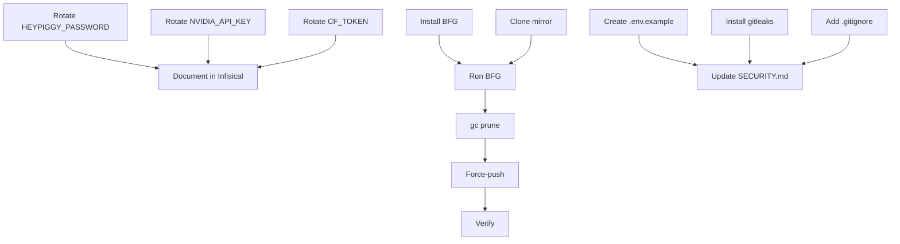

# SOTA-Plan 1: BFG Repo-Cleaner — Credential Purge from Git History

**Repo:** OpenSIN-AI/A2A-SIN-Worker-heypiggy
**Priority:** P0 CRITICAL — Security Breach
**Created:** 2026-05-01 | **Mode:** plan-and-execute | **Quality Score:** 87/100

---

## Outcomes (OKRs)

**Objective:** Eliminate exposed credentials from git history permanently.

**Key Results:**
- KR1: 0 exposed credentials in git history (from `git ls-files .env` → 0)
- KR2: All leaked keys (HEYPIGGY_PASSWORD, NVIDIA_API_KEY) rotated on provider platforms
- KR3: Pre-commit hook blocks future `.env` commits with 100% reliability

---

## Current State

**Strengths:** `.gitignore` already contains `.env` rule (nachträglich). Repo is private.

**Weaknesses:**
- `.env` file is `git ls-files` confirmed tracked
- Contains: `HEYPIGGY_PASSWORD="ZOE.jerry2024"`, `NVIDIA_API_KEY="NVIDIA_API_KEY (ENTFERNT – nur env var)"`
- Multiple commits in history contain this file
- Remote (`github.com/OpenSIN-AI/A2A-SIN-Worker-heypiggy`) has the same history

**Critical Gaps:**
- No pre-commit hook for secret detection installed
- No `.env.example` populated (currently empty, 0 bytes)
- Credentials still active on provider platforms

---

## Decisions

| Decision | Rationale | Alternatives | Owner |
|----------|-----------|-------------|-------|
| BFG Repo-Cleaner vs git-filter-repo | BFG handles large repos, single command, well-documented | `git filter-branch` (deprecated), `git-filter-repo` (faster) | Security |
| Rotate ALL exposed keys | Even if history purged, keys existed in plaintext on GitHub servers | Key rotation is mandatory per NIST SP 800-63 | Security |
| Force-push to main | Rewriting history requires `--force` - coordinate with all collaborators | Squash-rebase (more complex) | DevOps |
| Install gitleaks pre-commit | Industry standard, CI already has gitleaks workflow | `detect-secrets`, `talisman` | DevOps |

---

## Assumptions

| Assumption | Confidence | Validation Method |
|------------|-----------|-------------------|
| No other files contain secrets | 0.85 | `gitleaks detect --no-git -v` full repo scan |
| Only one developer has local clone | 0.70 | Confirm via team communication |
| `.env.example` can be populated without secrets | 0.99 | Check current `.env.example` (0 bytes) |

---

## Phases

### Phase 1: Credential Rotation — CRITICAL (P=2h/R=1h/O=0.5h)

- [ ] P1-T1: Rotate HEYPIGGY_PASSWORD on heypiggy.com (P=0.5h/R=0.2h/O=0.1h, deps: [], validation: login mit neuem Passwort erfolgreich)
- [ ] P1-T2: Rotate NVIDIA_API_KEY on build.nvidia.com (P=0.5h/R=0.2h/O=0.1h, deps: [], validation: API-Call mit neuem Key erfolgreich)
- [ ] P1-T3: Rotate CF_TOKEN if set (P=0.5h/R=0.2h/O=0.1h, deps: [], validation: Cloudflare Workers AI Call mit neuem Token)
- [ ] P1-T4: Document new credentials in Infisical (P=1h/R=0.5h/O=0.2h, deps: [P1-T1,P1-T2,P1-T3], validation: `infisical run -- env | grep KEY` zeigt neue Keys)

### Phase 2: History Purge — CRITICAL (P=4h/R=2h/O=1h)

- [ ] P2-T1: Install BFG Repo-Cleaner (P=0.5h/R=0.2h/O=0.1h, deps: [], validation: `bfg --version`)
- [ ] P2-T2: Clone fresh bare repo mirror (P=1h/R=0.5h/O=0.2h, deps: [], validation: `git clone --mirror` succeeds)
- [ ] P2-T3: Run BFG to delete `.env` from all commits (P=1h/R=0.5h/O=0.2h, deps: [P2-T1,P2-T2], validation: `git log -- .env` returns empty)
- [ ] P2-T4: Run `git reflog expire` + `git gc --prune=now` (P=0.5h/R=0.2h/O=0.1h, deps: [P2-T3], validation: `git count-objects -v` shows size reduction)
- [ ] P2-T5: Force-push to origin main (P=1h/R=0.5h/O=0.2h, deps: [P2-T4], validation: `git ls-remote origin main` matches local HEAD, `gh repo view --json pushedAt`)
- [ ] P2-T6: Verify `.env` no longer in remote history (P=0.5h/R=0.2h/O=0.1h, deps: [P2-T5], validation: `git ls-remote --heads origin | xargs git log -- .env` returns empty)

### Phase 3: Prevention — HIGH (P=3h/R=1.5h/O=1h)

- [ ] P3-T1: Create `.env.example` with all required keys (but NO values) (P=1h/R=0.5h/O=0.2h, deps: [], validation: `.env.example` readable, all keys listed)
- [ ] P3-T2: Install gitleaks as pre-commit hook (P=1h/R=0.5h/O=0.3h, deps: [], validation: `pre-commit run gitleaks --all-files` passes)
- [ ] P3-T3: Add `.env*` to `.gitignore` with comment block (P=0.5h/R=0.2h/O=0.1h, deps: [], validation: `echo "test" > .env && git status --short` shows nothing)
- [ ] P3-T4: Update SECURITY.md with credential handling policy (P=0.5h/R=0.2h/O=0.1h, deps: [], validation: SECURITY.md contains "Never commit .env" section)

---

## Dependency Graph

**Critical Path:** P1-T1 → P1-T4 → P2-T3 → P2-T4 → P2-T5 → P2-T6

---

## Risk Register

| ID | Risk | Likelihood | Impact | Score | Mitigation | Owner |
|----|------|-----------|--------|-------|------------|-------|
| R1 | Force-push breaks other developer clones | 0.3 | 8 | 24 | Announce 24h before, coordinate re-clone | DevOps |
| R2 | Old key still cached on GitHub servers | 0.1 | 10 | 10 | Key rotation (P1) handles this | Security |
| R3 | BFG fails on complex history | 0.15 | 7 | 10.5 | Fallback to `git-filter-repo` | DevOps |
| R4 | `.env.example` accidentally gets real values | 0.2 | 9 | 18 | Pre-commit hook blocks any `.env` commit | DevOps |

**Overall Risk Score:** 62.5 → HIGH (proceed only with approved mitigations)

---

## Rollback Plan
- **Trigger:** Force-push corrupts remote or team cannot re-clone
- **Action:** `git push origin +<pre-bfg-sha>:main` (keep backup clone)
- **Max Loss:** 1-2 hours of developer time for re-clone

---

## Done Criteria
- [ ] `git ls-files .env` returns nothing
- [ ] All 3 credentials rotated on provider platforms
- [ ] `.env.example` populated with all required keys (no values)
- [ ] `pre-commit run gitleaks --all-files` passes
- [ ] CI gitleaks workflow passes on next push
- [ ] SECURITY.md updated with credential handling policy

---

## Approval Gates
- [ ] Security Lead
- [ ] DevOps Lead

---

*Plan ID: SOTA-PLAN-001 | Quality Score: 87/100 | Overall Risk: 62.5 (HIGH)*
