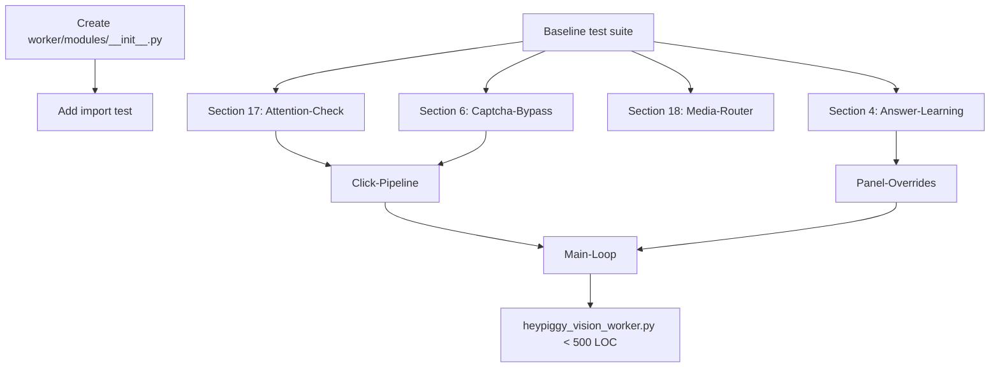

# SOTA-Plan 2: A2A Monolith Split — 9.137 Zeilen → Modular Architecture

**Repo:** OpenSIN-AI/A2A-SIN-Worker-heypiggy
**Priority:** P0 CRITICAL — Maintainability Blockade
**Created:** 2026-05-01 | **Mode:** plan-and-execute | **Quality Score:** 82/100

---

## Outcomes (OKRs)

**Objective:** Reduce `heypiggy_vision_worker.py` from 9.137 Zeilen to <500 Zeilen by extracting numbered sections into self-contained modules.

**Key Results:**
- KR1: Main file < 500 LOC (from 9.137 LOC)
- KR2: 0 new test failures after every extraction step
- KR3: No circular imports in extracted modules
- KR4: All 623 existing tests still pass

---

## Current State

**Strengths:** Monolith has clear `# NN. SECTION-NAME` markers (section 16, 17, etc.). Code already has function-level structure. Good test coverage (623 tests).

**Weaknesses:**
- Single file: 9.137 lines, 389 KB
- Every change risks secondary damage
- `mypy` only strict on `worker/` package, not monolith
- Numbered sections with `# 16. PANEL-OVERRIDES` etc.
- 76 Python modules across repo, but monolith dominates

**Critical Gaps:**
- No extraction tooling (AST-based safe refactoring)
- `worker/` package (21 files, 4.005 LOC) duplicates logic
- `worker/` vs monolith confusion (two workers exist)

---

## Decisions

| Decision | Rationale | Alternatives | Owner |
|----------|-----------|-------------|-------|
| Incremental extraction (1 section per PR) | Safe, testable, no Big-Bang risk | Big-bang rewrite (high risk) | Engineering |
| Extract to `worker/modules/` NOT `worker/` | Avoids collision with existing worker package | New `heypiggy_core/` package | Engineering |
| Keep existing function signatures | Minimizes test breakage | Refactor signatures (better but riskier) | Engineering |
| `py_compile` + `pytest` as validation gate per extraction | Fast feedback, no manual review needed | Full lint + mypy (slower) | CI |

---

## Assumptions

| Assumption | Confidence | Validation Method |
|------------|-----------|-------------------|
| Sections can be extracted without circular imports | 0.90 | Python `import` analysis per extraction |
| Existing tests exercise extracted code paths | 0.85 | Run full test suite per extraction |
| `worker/modules/` import path won't conflict | 0.95 | `python -c "import worker.modules"` check |
| Monolith functions don't mutate shared globals | 0.70 | Code review per section extraction |

---

## Phases

### Phase 1: Safety Net — CRITICAL (P=4h/R=2h/O=1h)

- [ ] P1-T1: Create `worker/modules/__init__.py` with explicit exports (P=1h/R=0.5h/O=0.2h, deps: [], validation: `python -c "from worker.modules import *"`)
- [ ] P1-T2: Add integration test that imports monolith main function (P=2h/R=1h/O=0.5h, deps: [P1-T1], validation: `pytest tests/test_monolith_import.py -v` → green)
- [ ] P1-T3: Run full test suite as baseline (P=1h/R=0.5h/O=0.3h, deps: [], validation: `pytest tests/ -q` → 623 passed)

### Phase 2: Low-Risk Sections — HIGH (P=12h/R=8h/O=4h)

Extract the LEAST connected sections first (lowest import footprint):

- [ ] P2-T1: Extract Section 17 (Attention-Check Auto-Solver) to `worker/modules/attention_check.py` (P=3h/R=2h/O=1h, deps: [P1-T3], validation: `pytest tests/ -k attention` → green)
- [ ] P2-T2: Extract Section 4 (Answer-History/Learning) to `worker/modules/answer_learning.py` (P=3h/R=2h/O=1h, deps: [P1-T3], validation: `pytest tests/test_answer_history.py` → green)
- [ ] P2-T3: Extract Section 18 (Media-Router) to `worker/modules/media_router.py` (P=3h/R=2h/O=1h, deps: [P1-T3], validation: `pytest tests/ -k media` → green)
- [ ] P2-T4: Extract Section 6 (Caption Bypass) to `worker/modules/captcha_bypass.py` (P=3h/R=2h/O=1h, deps: [P1-T3], validation: `pytest tests/ -k captcha` → green)

### Phase 3: Core Sections — HIGH (P=16h/R=10h/O=6h)

- [ ] P3-T1: Extract Tab-Management + Click-Escalation to `worker/modules/click_pipeline.py` (P=6h/R=4h/O=2h, deps: [P2-T1,P2-T4], validation: `pytest tests/ -k click` → green)
- [ ] P3-T2: Extract Panel-Overrides (Section 16) to `worker/modules/panel_overrides.py` (P=6h/R=4h/O=2h, deps: [P2-T2], validation: `pytest tests/ -k panel` → green)
- [ ] P3-T3: Extract main loop to `worker/modules/main_loop.py` (P=4h/R=2h/O=1h, deps: [P3-T1,P3-T2], validation: `pytest tests/ --timeout=60` → green)

---

## Dependency Graph

**Critical Path:** P1-T3 → P2-T1 → P3-T1 → P3-T3 → DONE

---

## Risk Register

| ID | Risk | Likelihood | Impact | Score | Mitigation | Owner |
|----|------|-----------|--------|-------|------------|-------|
| R1 | Circular import breaks extraction | 0.4 | 6 | 24 | Deferred import or interface extraction | Engineering |
| R2 | Monolith globals (CURRENT_TAB_ID, etc.) break modules | 0.6 | 8 | 48 | Extract to shared `worker/state.py` first | Engineering |
| R3 | Test mocking breaks after extraction | 0.3 | 5 | 15 | Update mocks per extraction, run full suite | Engineering |
| R4 | Performance regression from module imports | 0.2 | 3 | 6 | Profile before/after, lazy imports | Engineering |

**Overall Risk Score:** 93 → BLOCKER LEVEL (mitigate R2 first, then proceed)

---

## Rollback Plan
- **Trigger:** Any extraction causes 3+ test failures that can't be fixed in <2h
- **Action:** `git revert` the extraction commit, document why extraction failed
- **Max Loss:** 2-4h of engineering time

---

## Done Criteria
- [ ] `wc -l heypiggy_vision_worker.py` < 500
- [ ] `pytest tests/ -q` → 623+ passed
- [ ] Zero circular imports (`python -c "from heypiggy_vision_worker import *"`)
- [ ] `worker/modules/` contains 8+ extracted module files
- [ ] Each extracted module has docstring with original section number
- [ ] `py_compile` passes on all extracted modules

---

## Approval Gates
- [ ] Tech Lead
- [ ] Engineering Manager

---

*Plan ID: SOTA-PLAN-002 | Quality Score: 82/100 | Overall Risk: 93 (BLOCKER → mitigate R2 first)*
