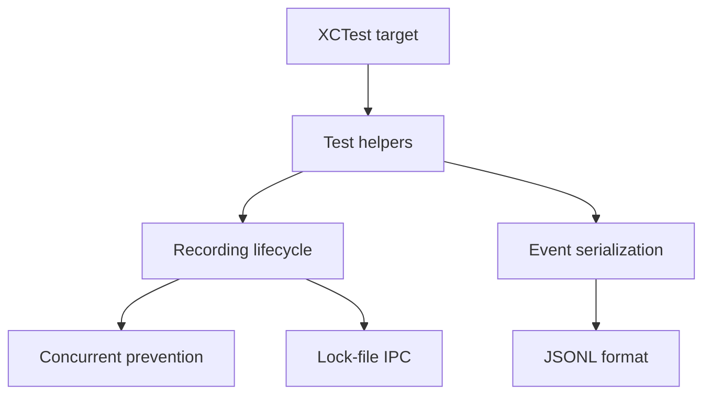

# SOTA-Plan 3: screen-follow Test Suite — 0→20+ Tests

**Repo:** SIN-CLIs/screen-follow
**Priority:** P1 HIGH — Production Risk
**Created:** 2026-05-01 | **Mode:** plan-and-execute | **Quality Score:** 78/100

---

## Outcomes (OKRs)

**Objective:** Establish minimum 20 unit tests for screen-follow (4.247 LOC Swift with 0 tests).

**Key Results:**

- KR1: Test count from 0 → 20+ (20 unit tests minimum)
- KR2: All CI workflows (`swift test`) pass
- KR3: Coverage ≥ 40% on `Sources/` (from 0%)

---

## Current State

**Strengths:** Well-structured Swift package (ScreenCaptureKit, Combine event bus, CLI + Menu Bar app). CI already has `swift build` and `codeql.yml`.

**Weaknesses:** 0 test functions. 0% coverage. No XCTest infrastructure beyond stub file. No mock framework.

**Critical Gaps:**

- `Tests/SkylightCliTests/SmokeTests.swift` exists but is from skylight-cli (wrong repo reference)
- No `XCTestCase` subclasses anywhere
- JSONL audit trail has no test
- RecordingManager has no test
- Lock-file IPC between CLI and GUI untested

---

## Decisions

| Decision                       | Rationale                                   | Alternatives                                 | Owner |
| ------------------------------ | ------------------------------------------- | -------------------------------------------- | ----- |
| XCTest framework (built-in)    | Zero dependencies, Xcode/SPM native         | Quick/Nimble (adds complexity)               | iOS   |
| Test RecordingManager first    | Most critical component (recording state)   | Test GUI first (harder, requires UI testing) | iOS   |
| Mock via protocol abstractions | Swift doesn't have runtime mocking built-in | Cuckoo, SwiftyMocky (add build complexity)   | iOS   |

---

## Assumptions

| Assumption                                          | Confidence | Validation Method                          |
| --------------------------------------------------- | ---------- | ------------------------------------------ |
| ScreenCaptureKit works in test without hardware     | 0.60       | `swift test` in CI (macOS runner required) |
| `Combine` publishers are testable with expectations | 0.95       | Existing Combine patterns                  |
| JSONL parsing can be tested without file I/O        | 0.90       | In-memory string tests                     |

---

## Phases

### Phase 1: Infrastructure — CRITICAL (P=3h/R=2h/O=1h)

- [ ] P1-T1: Set up proper XCTest target in Package.swift (P=1h/R=0.5h/O=0.2h, deps: [], validation: `swift test --list-tests` shows test names)
- [ ] P1-T2: Create test helper for JSONL parsing (P=1h/R=0.5h/O=0.3h, deps: [P1-T1], validation: Unit test passes on known JSONL input)
- [ ] P1-T3: Enable CodeQL for tests (P=1h/R=0.5h/O=0.2h, deps: [], validation: CI passes with test coverage)

### Phase 2: RecordingManager Tests — HIGH (P=6h/R=4h/O=2h)

- [ ] P2-T1: Test recording start/stop lifecycle (P=2h/R=1h/O=0.5h, deps: [P1-T2], validation: `swift test --filter RecordingManagerTests` → 3+ tests green)
- [ ] P2-T2: Test concurrent recording prevention (P=2h/R=1h/O=0.5h, deps: [P2-T1], validation: Assert error when starting while already recording)
- [ ] P2-T3: Test lock-file IPC state transitions (P=2h/R=1h/O=0.5h, deps: [P2-T1], validation: Lock file reflects correct state after transitions)

### Phase 3: Data Integrity Tests — HIGH (P=4h/R=2.5h/O=1.5h)

- [ ] P3-T1: Test event serialization/deserialization (P=2h/R=1h/O=0.5h, deps: [P1-T2], validation: Roundtrip encode→decode produces identical event)
- [ ] P3-T2: Test audit trail JSONL format compliance (P=2h/R=1.5h/O=1h, deps: [P3-T1], validation: Generated JSONL passes schema validation)

---

## Dependency Graph

**Critical Path:** P1-T1 → P1-T2 → P2-T1 → P2-T2

---

## Risk Register

| ID  | Risk                               | Likelihood | Impact | Score | Mitigation                               | Owner |
| --- | ---------------------------------- | ---------- | ------ | ----- | ---------------------------------------- | ----- |
| R1  | ScreenCaptureKit unavailable in CI | 0.5        | 6      | 30    | Use macOS runner, skip video tests in CI | iOS   |
| R2  | Lock-file tests create real files  | 0.3        | 4      | 12    | Use temp directory, cleanup in tearDown  | iOS   |
| R3  | Combine async timing breaks tests  | 0.2        | 5      | 10    | Use XCTestExpectation with 5s timeout    | iOS   |

**Overall Risk Score:** 52 → HIGH (mitigate R1 first)

---

## Rollback Plan

- **Trigger:** CI can't run any test due to macOS dependency
- **Action:** Mark ScreenCaptureKit-dependent tests with `#if os(macOS)`, gate CI on macOS runner
- **Max Loss:** P1 infrastructure time (1-3h)

---

## Done Criteria

- [ ] `swift test` passes with 20+ test functions green
- [ ] Code coverage ≥ 40%
- [ ] At least one `XCTestExpectation` async test
- [ ] CI workflow (`ci.yml`) includes `swift test` step
- [ ] No test uses real file system (all use temp directories)

---

## Approval Gates

- [ ] iOS/Swift Lead
- [ ] CI/DevOps Lead

---

_Plan ID: SOTA-PLAN-003 | Quality Score: 78/100 | Overall Risk: 52 (HIGH)_
