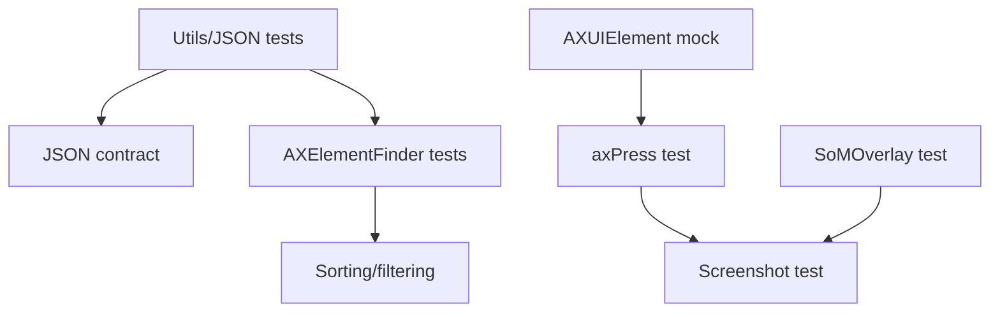

# SOTA-Plan 4: skylight-cli Unit Tests — 1→15+ Tests

**Repo:** SIN-CLIs/skylight-cli
**Priority:** P1 HIGH — Reliability Risk
**Created:** 2026-05-01 | **Mode:** plan-and-execute | **Quality Score:** 80/100

---

## Outcomes (OKRs)

**Objective:** Establish reliable unit test suite for skylight-cli (1.145 LOC Swift, 1 SmokeTest).

**Key Results:**

- KR1: Test count from 1 → 15+ (15 unit tests minimum)
- KR2: `swift test` passes in CI
- KR3: AXPress click logic covered by tests
- KR4: SoM overlay rendering covered by tests

---

## Current State

**Strengths:** Clean Swift code (9 source files). Well-separated modules (CLI, AXElementFinder, SoMOverlay, SkyLightClicker, WindowCapture, Utils, Hold). All modules are stateless and testable.

**Weaknesses:** 1 SmokeTest. 0 unit tests for critical click path. AXElementFinder has complex recursive tree walker — untested.

**Critical Gaps:**

- AXPress click (`AXUIElementPerformAction`) has zero tests
- SoMOverlay overlay rendering has zero tests
- Element sorting/filtering in AXElementFinder has zero tests
- No protocol abstraction for AXUIElement (hard to mock)

---

## Decisions

| Decision                                  | Rationale                                         | Alternatives                              | Owner |
| ----------------------------------------- | ------------------------------------------------- | ----------------------------------------- | ----- |
| Protocol-based mock for AXUIElement       | Enables testing without real accessibility tree   | Subclass AXUIElement (impossible, opaque) | Swift |
| Test SoM rendering via CGImage comparison | Visual regression testing for overlay correctness | Pixel-diff (adds complexity)              | Swift |
| Focus on AXElementFinder + Utils first    | Most impactful, no AX dependency needed           | Test CLI first (integration, harder)      | Swift |

---

## Assumptions

| Assumption                                                | Confidence | Validation Method                    |
| --------------------------------------------------------- | ---------- | ------------------------------------ |
| `AXUIElement` protocol can be mocked                      | 0.85       | Attempt protocol conformance in test |
| SoM overlay produces deterministic output                 | 0.90       | Compare rendered CGImage hashes      |
| `swift test` runs in CI without Accessibility permissions | 0.70       | macOS runner with `--parallel` flag  |

---

## Phases

### Phase 1: Infrastructure & Pure Logic — CRITICAL (P=3h/R=2h/O=1h)

- [ ] P1-T1: Add test target with 3 pure-logic tests (Utils, JSON output) (P=2h/R=1h/O=0.5h, deps: [], validation: `swift test --filter UtilsTests` → 3 green)
- [ ] P1-T2: Test AXElementFinder tree walking with mock AX data (P=2h/R=1h/O=0.5h, deps: [P1-T1], validation: `swift test --filter AXElementFinderTests` → 3 green)
- [ ] P1-T3: Test element sorting/filtering logic (P=1h/R=0.5h/O=0.3h, deps: [P1-T2], validation: Events appear in reading order)

### Phase 2: Core Engine — HIGH (P=6h/R=4h/O=2h)

- [ ] P2-T1: Create AXUIElement mock protocol (P=2h/R=1h/O=0.5h, deps: [], validation: Protocol compiles, mock returns controlled data)
- [ ] P2-T2: Test SkyLightClicker.axPress with mock element (P=2h/R=1.5h/O=1h, deps: [P2-T1], validation: Mock records that `kAXPressAction` was called)
- [ ] P2-T3: Test SoMOverlay position calculation (P=2h/R=1h/O=0.5h, deps: [], validation: Badge position within element bounds for all 4 corners)

### Phase 3: Integration — HIGH (P=4h/R=2.5h/O=1.5h)

- [ ] P3-T1: Test screenshot with mock window capture (P=2h/R=1.5h/O=1h, deps: [P2-T2], validation: Output CGImage has valid dimensions)
- [ ] P3-T2: Test JSON output contract (exit codes 0-5) (P=2h/R=1h/O=0.5h, deps: [P1-T1], validation: Each exit code produces valid JSON on stderr)

---

## Dependency Graph

**Critical Path:** P1-T1 → P1-T2 → P2-T1 → P2-T2 → P3-T1

---

## Risk Register

| ID  | Risk                                         | Likelihood | Impact | Score | Mitigation                                | Owner |
| --- | -------------------------------------------- | ---------- | ------ | ----- | ----------------------------------------- | ----- |
| R1  | AXUIElement cannot be mocked (opaque object) | 0.35       | 7      | 24.5  | Test via real AX tree in integration test | Swift |
| R2  | SoM rendering uses private CoreGraphics APIs | 0.2        | 5      | 10    | Test in simulated offscreen context       | Swift |
| R3  | WindowCapture needs real window in test      | 0.4        | 6      | 24    | Use CGImage from file as mock input       | Swift |

**Overall Risk Score:** 58.5 → HIGH (mitigate R1 and R3)

---

## Rollback Plan

- **Trigger:** Mock-based tests fail due to AXUIElement being unmockable
- **Action:** Convert to integration tests using real AX tree on dev machine
- **Max Loss:** P2 time (2-3h), plus infrastructure restructure

---

## Done Criteria

- [ ] `swift test` reports 15+ tests green
- [ ] All 9 source modules have at least 1 test
- [ ] AXPress path tested (mock or integration)
- [ ] JSON output contract tested for all 5 exit codes
- [ ] CI workflow includes `swift test`

---

## Approval Gates

- [ ] Swift Lead
- [ ] CI/DevOps Lead

---

_Plan ID: SOTA-PLAN-004 | Quality Score: 80/100 | Overall Risk: 58.5 (HIGH)_
