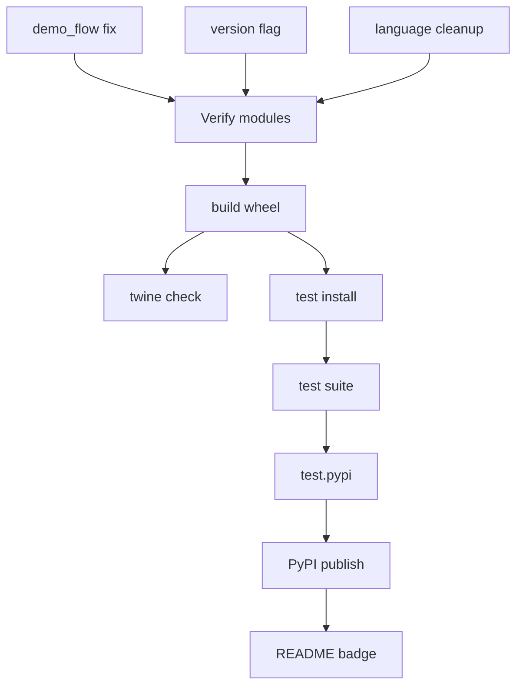

# SOTA-Plan 5: PyPI Release playstealth-cli — 0.9.0-beta → v1.0.0

**Repo:** SIN-CLIs/playstealth-cli
**Priority:** P1 HIGH — Distribution Blockade
**Created:** 2026-05-01 | **Mode:** plan-and-execute | **Quality Score:** 84/100

---

## Outcomes (OKRs)

**Objective:** Publish playstealth-cli v1.0.0 on PyPI with working `pip install playstealth-cli`.

**Key Results:**

- KR1: `pip install playstealth-cli` succeeds on Python 3.11+
- KR2: PyPI package version shows `1.0.0` (from current `0.9.0-beta`)
- KR3: All 176 existing tests pass in packaged state
- KR4: README renders correctly on PyPI (badges, formatting)
- KR5: `playstealth --version` outputs `1.0.0`

---

## Current State

**Strengths:** Well-structured `pyproject.toml` (setuptools build). CI already has `release-please.yml`. Package already tested via `pip install -e '.[dev]'`. 176 test functions. demo_flow and plugin system working.

**Weaknesses:**

- `demo_flow.py` top-level import breaks after pipx install
- PyPI badge in README points to nonexistent 1.0.0
- Language mix in CLI strings (DE/EN)
- No `--version` flag implemented yet
- `__version__` not exposed in `playstealth_cli.py`
- 4 empty test files (Resilience Engine tests)

**Critical Gaps:**

- Package never published to PyPI
- No Twine/check-manifest validation
- Setuptools `py-modules` field may miss some action modules
- `scripts/stealth_benchmark.py` needs playwright chromium binary for CI

---

## Decisions

| Decision                                        | Rationale                                     | Alternatives                              | Owner  |
| ----------------------------------------------- | --------------------------------------------- | ----------------------------------------- | ------ |
| Setuppy-based build (setuptools)                | Already configured, works with pip install -e | Hatchling/Poetry (adds migration cost)    | Python |
| `python -m build` + `twine check`               | PyPA standard, validates before upload        | `flit publish` (simpler but less control) | Python |
| Fix demo_flow import before release             | Top-level import breaks pipx — known bug      | Defer to v1.0.1 (backlog)                 | Python |
| Keep 0.9.0-beta tag, release 1.0.0 as new major | Semver convention, clear upgrade path         | Overwrite 0.9.0-beta (confusing)          | Python |

---

## Assumptions

| Assumption                                    | Confidence | Validation Method                                                |
| --------------------------------------------- | ---------- | ---------------------------------------------------------------- |
| All action modules listed in `pyproject.toml` | 0.80       | `python -c "import playstealth_actions"` after install           |
| Playwright dependency works in PyPI context   | 0.90       | `pip install playstealth-cli` then `playwright install chromium` |
| test.pypi.org credentials are available       | 0.70       | Check Infisical for PYPI_TOKEN                                   |

---

## Phases

### Phase 1: Pre-Release Cleanup — CRITICAL (P=6h/R=4h/O=2h)

- [ ] P1-T1: Fix `demo_flow.py` import (relative or lazy) (P=2h/R=1h/O=0.5h, deps: [], validation: `pipx install .` then `playstealth` doesn't crash)
- [ ] P1-T2: Add `__version__` to `playstealth_cli.py` and `--version` flag (P=2h/R=1h/O=0.5h, deps: [], validation: `playstealth --version` → `1.0.0`)
- [ ] P1-T3: Unify CLI language to EN (all strings) (P=3h/R=2h/O=1h, deps: [], validation: `grep -r "Wähle\|Klicke\|Fehler" playstealth_cli.py` returns 0)
- [ ] P1-T4: Verify all modules in `pyproject.toml` `py-modules` field (P=1h/R=0.5h/O=0.2h, deps: [], validation: `python -c "import playstealth_actions.plugins"` works)

### Phase 2: Package Validation — HIGH (P=3h/R=2h/O=1h)

- [ ] P2-T1: Run `python -m build` and verify wheel contents (P=1h/R=0.5h/O=0.2h, deps: [P1-T4], validation: `unzip -l dist/*.whl | grep playstealth` shows all modules)
- [ ] P2-T2: Run `twine check dist/*` (P=0.5h/R=0.2h/O=0.1h, deps: [P2-T1], validation: `PASSED` with no warnings)
- [ ] P2-T3: Test install from local wheel in clean venv (P=1h/R=0.5h/O=0.2h, deps: [P2-T1], validation: `pip install dist/*.whl && playstealth --version` works)
- [ ] P2-T4: Run test suite against installed package (P=1h/R=0.5h/O=0.2h, deps: [P2-T3], validation: `pytest tests/ -q` → 176 passed)

### Phase 3: Release — HIGH (P=2h/R=1h/O=0.5h)

- [ ] P3-T1: Test publish to test.pypi.org (P=1h/R=0.5h/O=0.2h, deps: [P2-T4], validation: `pip install -i https://test.pypi.org/simple/ playstealth-cli`)
- [ ] P3-T2: Publish to PyPI (P=0.5h/R=0.2h/O=0.1h, deps: [P3-T1], validation: `pip install playstealth-cli` from anywhere)
- [ ] P3-T3: Update README PyPI badge with real version (P=0.5h/R=0.2h/O=0.1h, deps: [P3-T2], validation: Badge link goes to correct PyPI page)

---

## Dependency Graph

**Critical Path:** P1-T1 → P1-T4 → P2-T1 → P2-T3 → P2-T4 → P3-T1 → P3-T2

---

## Risk Register

| ID  | Risk                                             | Likelihood | Impact | Score | Mitigation                                                  | Owner  |
| --- | ------------------------------------------------ | ---------- | ------ | ----- | ----------------------------------------------------------- | ------ |
| R1  | PyPI credentials missing/expired                 | 0.3        | 9      | 27    | Check Infisical, generate new token if needed               | Python |
| R2  | Playwright binary too large for test install     | 0.2        | 4      | 8     | Document `playwright install chromium` as post-install step | Python |
| R3  | Breaking change introduced                       | 0.15       | 8      | 12    | Test full install + run survey flow before publishing       | Python |
| R4  | Import error from setuptools py-modules mismatch | 0.25       | 7      | 17.5  | P1-T4 catches this before build                             | Python |

**Overall Risk Score:** 64.5 → CRITICAL (P1 mitigations installed before P2)

---

## Rollback Plan

- **Trigger:** PyPI publish breaks existing installs
- **Action:** `pip install playstealth-cli==0.9.0-beta` (keep old version tagged), fix and release 1.0.1
- **Max Loss:** 30 min of any user down time

---

## Done Criteria

- [ ] `pip install playstealth-cli` succeeds on Python 3.11+
- [ ] `playstealth --version` outputs `1.0.0`
- [ ] PyPI page shows `1.0.0` with valid README
- [ ] `pytest tests/ -q` → 176 passed after pip install
- [ ] All `stealth-bench.yml` CI workflow passes

---

## Approval Gates

- [ ] Python Lead
- [ ] Release Manager

---

_Plan ID: SOTA-PLAN-005 | Quality Score: 84/100 | Overall Risk: 64.5 (CRITICAL)_
