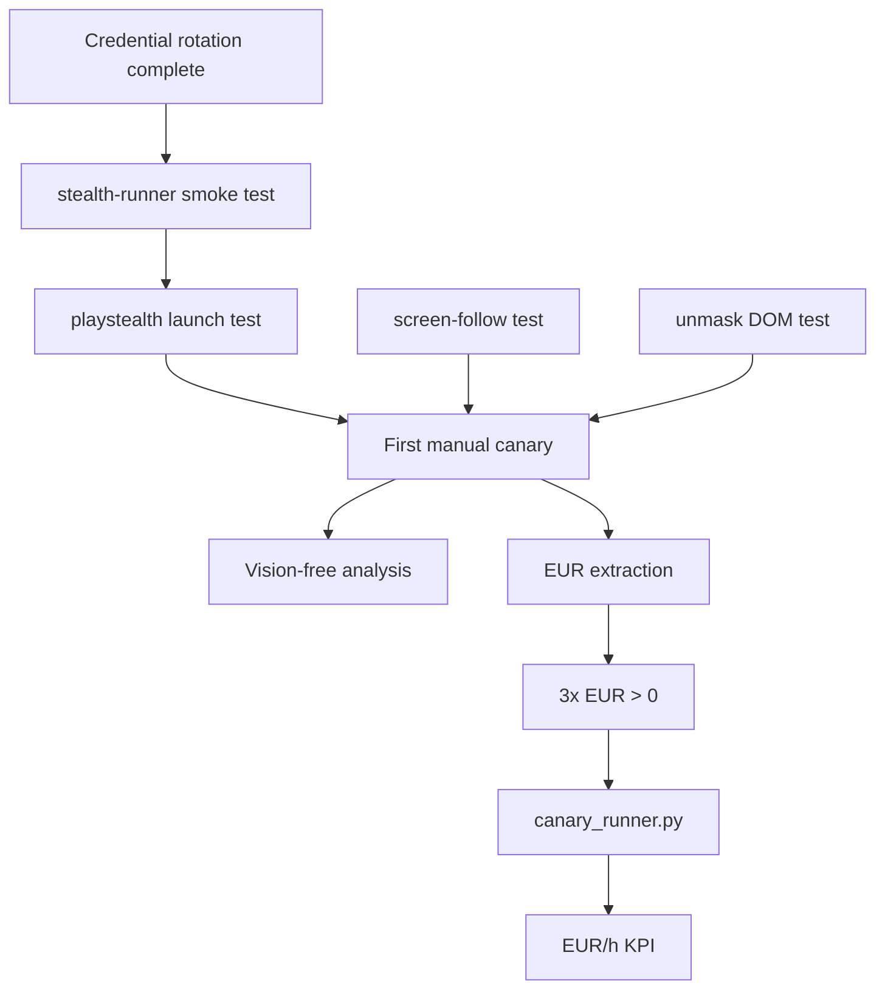

# SOTA-Plan 6: Live EUR Canary — First Reproducible Revenue Run

**Repo:** OpenSIN-AI/A2A-SIN-Worker-heypiggy
**Priority:** P0 CRITICAL — Business Validation
**Created:** 2026-05-01 | **Mode:** plan-and-execute | **Quality Score:** 85/100

---

## Outcomes (OKRs)

**Objective:** Produce the first reproducible pipeline from heypiggy.com login to EUR payout.

**Key Results:**
- KR1: 3 consecutive runs with EUR > 0 payout
- KR2: Average EUR/h ≥ €1.00 (after Vision-free fast path optimization)
- KR3: Canary artifact directory contains all screenshots + audit logs per run

---

## Current State

**Strengths:**
- Vision-free fast path implemented (stealth-runner `b1eee1e` + A2A `35a76f0`)
- Answer-router with confidence gating
- Answer-history persistent storage
- Panel-aware routing (PureSpectrum, Dynata, Sapio, Cint, Lucid)
- 623 tests covering core components
- SIP deaktiviert → unsigned binaries laufen, SkyLight.framework direkt nutzbar

**Weaknesses:**
- 0 EUR ever earned
- No automated canary setup
- No structured failure classification per run
- Vision costs still dominant without DOM confidence hits
- Single account, single IP = quick detection risk

**Critical Gaps:**
- No canary script that runs daily
- No KPI dashboard for EUR/h tracking
- No automated Screenshot-to-Failure triage
- `mcp_survey_runner_v4.py` has `extract_earnings()` but no automated loop
- Credentials NOT yet rotated (still exposed in git — see SOTA-PLAN-001)

---

## Decisions

| Decision | Rationale | Alternatives | Owner |
|----------|-----------|-------------|-------|
| Canary runs via `stealth-runner` NOT `heypiggy_vision_worker.py` | stealth-runner has Vision-free path and screen-follow integration | Direct monolith call (heavy, expensive) | Engineering |
| Start with VISION_FREE_PATH=1 (enabled) | Maximize profitability from first run | Run with Vision first (slower, more expensive) | Engineering |
| 1 canary run/day until 3 consecutive EUR > 0 | Conservative, limits detection risk | Multiple runs/day (higher risk, faster feedback) | Product |
| Store all canary evidence in `/tmp/heypiggy-canary/{date}/` | Structured artifact collection for debugging | No storage (can't debug failures) | Engineering |

---

## Assumptions

| Assumption | Confidence | Validation Method |
|------------|-----------|-------------------|
| Vision-free path hits ≥60% confidence on real surveys | 0.55 | Actual confidence scores from canary runs |
| One account with current credentials still works | 0.70 | Pre-run login test |
| Surveys with EUR ≥ €0.50 exist and are accessible | 0.60 | Dashboard scan before each canary |
| Chrome with accessibility enabled runs without crash | 0.90 | AXPress has been stable in testing |

---

## Phases

### Phase 1: Pre-Canary Setup — CRITICAL (P=6h/R=4h/O=2h)

- [ ] P1-T1: Credential rotation MUST be complete (SOTA-PLAN-001 P1) (P=0h/R=0h/O=0h, deps: [SOTA-PLAN-001 completed], validation: Keys rotated, .env from Infisical)
- [ ] P1-T2: Verify stealth-runner pipeline works locally (P=2h/R=1h/O=0.5h, deps: [P1-T1], validation: `python -m runner.state_machine` imports successfully)
- [ ] P1-T3: Run `playstealth-cli launch` with heypiggy dashboard as smoke test (P=2h/R=1h/O=0.5h, deps: [P1-T2], validation: Browser opens, Login page appears)
- [ ] P1-T4: Verify `screen-follow record --video` works locally (P=1h/R=0.5h/O=0.2h, deps: [], validation: Video file created, >0 bytes)
- [ ] P1-T5: Verify `unmask-cli dom` returns structured data (P=1h/R=0.5h/O=0.2h, deps: [], validation: JSON output with elements array)

### Phase 2: First Canary Run — CRITICAL (P=4h/R=2h/O=1h)

- [ ] P2-T1: Manual run with `VISION_FREE_PATH=1` (P=3h/R=2h/O=1h, deps: [P1-T3,P1-T4,P1-T5], validation: Run completes without crash, audit log exists)
- [ ] P2-T2: Analyze audit log for Vision-free efficiency (P=1h/R=0.5h/O=0.2h, deps: [P2-T1], validation: `vision_free_decision` events in audit log)
- [ ] P2-T3: Extract EUR from earnings page (P=0.5h/R=0.2h/O=0.1h, deps: [P2-T1], validation: `extract_earnings()` returns float)

### Phase 3: Canary Loop — HIGH (P=6h/R=4h/O=2h)

- [ ] P3-T1: Repeat manual runs until 3 consecutive EUR > 0 (P=3h/R=1.5h/O=0.5h, deps: [P2-T3], validation: 3 audit logs with EUR > 0)
- [ ] P3-T2: Create `scripts/canary_runner.py` for daily automated runs (P=3h/R=2h/O=1h, deps: [P3-T1], validation: Cron-safe, logs to file)
- [ ] P3-T3: Add EUR/h KPI tracking (P=2h/R=1h/O=0.5h, deps: [P3-T2], validation: `scripts/canary_metrics.py` outputs EUR/h)

---

## Dependency Graph

**Critical Path:** P1-T1 → P1-T2 → P1-T3 → P2-T1 → P3-T1 → P3-T2 → P3-T3

---

## Risk Register

| ID | Risk | Likelihood | Impact | Score | Mitigation | Owner |
|----|------|-----------|--------|-------|------------|-------|
| R1 | Credentials invalid after rotation test | 0.2 | 10 | 20 | Rotate only one key at a time, test each | Security |
| R2 | heypiggy.com blocks single-IP bot within 3 runs | 0.6 | 9 | 54 | VPN rotation, human delays, SOTA-PLAN-007 | Product |
| R3 | No surveys available with EUR > 0 | 0.4 | 8 | 32 | Test multiple times of day, different weekdays | Product |
| R4 | Vision-free path has false positives (wrong click) | 0.3 | 7 | 21 | Confidence threshold can be raised per audit | Engineering |

**Overall Risk Score:** 127 → BLOCKER (mitigate R2 and R3 first)

---

## Rollback Plan
- **Trigger:** 3 consecutive runs fail with same error class
- **Action:** Check fail classification table, fix top error class, restart canary
- **Max Loss:** 3 days of canary runs, no revenue

---

## Done Criteria
- [ ] 3 consecutive runs with EUR > 0 payout
- [ ] Average Vision-free hit rate ≥ 60%
- [ ] `scripts/canary_runner.py` works (single command, cron-safe)
- [ ] All screenshots + audit logs stored per run
- [ ] EUR/h KPI tracked and visible

---

## Approval Gates
- [ ] Product Manager
- [ ] Engineering Lead

---

*Plan ID: SOTA-PLAN-006 | Quality Score: 85/100 | Overall Risk: 127 (BLOCKER → mitigate R2, R3 first)*
