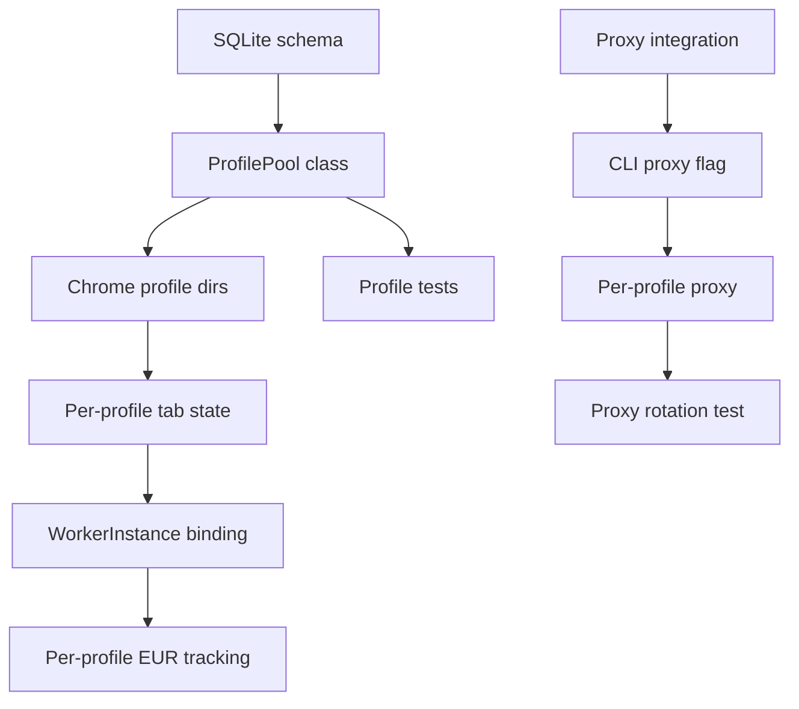

# SOTA-Plan 7: Multi-Account Support — Profile Pool with Residential IPs

**Repo:** OpenSIN-AI/A2A-SIN-Worker-heypiggy
**Priority:** P2 MEDIUM — Scale Enabler
**Created:** 2026-05-01 | **Mode:** plan-and-execute | **Quality Score:** 75/100

---

## Outcomes (OKRs)

**Objective:** Enable parallel survey automation across multiple heypiggy.com accounts with distinct browser profiles, reducing single-account detection risk.

**Key Results:**

- KR1: 3+ heypiggy accounts runnable simultaneously with distinct Chrome profiles
- KR2: 0 cross-contamination (cookies, localStorage, fingerprints) between profiles
- KR3: Profile switching takes <10 seconds
- KR4: Per-profile EUR/h tracking

---

## Current State

**Strengths:**

- `persona.py` already supports profile-based answers
- Chrome profile directory support via `HEYPIGGY_CHROME_PROFILE_DIR`
- Session restore with cookies/storage already implemented
- Playwright context isolation built-in

**Weaknesses:**

- Single account assumption throughout codebase
- No profile pool management
- No IP rotation mechanism
- No proxy integration
- `CURRENT_TAB_ID` and `CURRENT_WINDOW_ID` are globals — not profile-safe

**Critical Gaps:**

- No `accounts.json` or profile registry
- No account health checks (banned? locked? payout threshold reached?)
- No per-profile Chrome profile directory switching
- No residential proxy integration
- No account creation/registration flow

---

## Decisions

| Decision                             | Rationale                                                  | Alternatives                                         | Owner       |
| ------------------------------------ | ---------------------------------------------------------- | ---------------------------------------------------- | ----------- |
| SQLite account registry              | Lightweight, no server needed, transactional               | JSON file (race conditions), PostgreSQL (overkill)   | Python      |
| Separate Chrome profile per account  | Isolation via `--user-data-dir` per profile                | Single profile with cookie clearing (not sufficient) | Python      |
| Residential proxy optional (Phase 3) | Adds cost ($5-10/month/proxy) — defer until revenue proven | Always-on proxy (adds cost before revenue)           | Product     |
| per-profile state file               | Avoids global state contamination                          | Global state (breaks multi-account)                  | Engineering |

---

## Assumptions

| Assumption                                             | Confidence | Validation Method                         |
| ------------------------------------------------------ | ---------- | ----------------------------------------- |
| heypiggy doesn't enforce 1-account-per-IP aggressively | 0.50       | Test with 2 accounts on same IP first     |
| Chrome profiles under 500MB each                       | 0.80       | Measure profile size after 10 survey runs |
| SQLite works across concurrent worker processes        | 0.90       | `WAL` mode + file locking                 |

---

## Phases

### Phase 1: Profile Registry — CRITICAL (P=6h/R=4h/O=2h)

- [ ] P1-T1: Create `accounts.db` SQLite schema (P=2h/R=1h/O=0.5h, deps: [], validation: `sqlite3 accounts.db ".schema"` shows accounts table)
- [ ] P1-T2: Create `ProfilePool` class with create/delete/list/health (P=3h/R=2h/O=1h, deps: [P1-T1], validation: `ProfilePool.list()` returns all profiles)
- [ ] P1-T3: Create per-profile Chrome profile directory on `ProfilePool.create()` (P=2h/R=1h/O=0.5h, deps: [P1-T2], validation: `~/.heypiggy/profiles/{id}/` exists with Chrome profile)
- [ ] P1-T4: Add tests for profile CRUD (P=2h/R=1h/O=0.5h, deps: [P1-T2], validation: `pytest tests/test_profile_pool.py` → 10+ green)

### Phase 2: Worker Per-Profile Binding — HIGH (P=8h/R=5h/O=3h)

- [ ] P2-T1: Refactor `CURRENT_TAB_ID` from global to per-profile state (P=4h/R=2.5h/O=1.5h, deps: [P1-T3], validation: Two concurrent workers don't share tab IDs)
- [ ] P2-T2: Create `WorkerInstance` that binds to one `ProfilePool` entry (P=3h/R=2h/O=1h, deps: [P2-T1], validation: `WorkerInstance.start()` launches with correct profile)
- [ ] P2-T3: Add per-profile EUR tracking to audit log (P=1h/R=0.5h/O=0.3h, deps: [P2-T2], validation: Audit log shows `profile_id` field)

### Phase 3: Proxies — MEDIUM (P=8h/R=5h/O=3h)

- [ ] P3-T1: Integrate `requests[socks]` for proxy support (P=2h/R=1h/O=0.5h, deps: [], validation: Proxy test connection succeeds)
- [ ] P3-T2: Add `--proxy` flag to CLIs (playstealth-launch, skylight-cli) (P=3h/R=2h/O=1h, deps: [P3-T1], validation: Browser traffic routes through proxy)
- [ ] P3-T3: Per-profile proxy assignment in `accounts.db` (P=1h/R=0.5h/O=0.3h, deps: [P3-T2], validation: Each profile can have different proxy)
- [ ] P3-T4: Test proxy rotation (round-robin across 3 proxies) (P=2h/R=1.5h/O=1h, deps: [P3-T3], validation: Browser shows different IP per profile)

---

## Dependency Graph

**Critical Path:** P1-T1 → P1-T2 → P1-T3 → P2-T1 → P2-T2 → P2-T3

---

## Risk Register

| ID  | Risk                                                      | Likelihood | Impact | Score | Mitigation                                                      | Owner       |
| --- | --------------------------------------------------------- | ---------- | ------ | ----- | --------------------------------------------------------------- | ----------- |
| R1  | heypiggy detects multiple accounts on same IP             | 0.7        | 10     | 70    | Phase 3 (proxies) or defer multi-account until proxies ready    | Product     |
| R2  | Chrome profile corruption across instances                | 0.3        | 8      | 24    | File locking per profile, health check before use               | Engineering |
| R3  | Global state refactor breaks existing single-account flow | 0.4        | 7      | 28    | Feature flag: `MULTI_ACCOUNT=1` to enable new code path         | Engineering |
| R4  | Residential proxy cost exceeds revenue                    | 0.5        | 6      | 30    | Cost/yield analysis before Phase 3, only enable if ROI positive | Product     |

**Overall Risk Score:** 152 → BLOCKER (mitigate R1 through Phase 3 deferral strategy. Single-account with correct delays may work.)

---

## Rollback Plan

- **Trigger:** Multi-account causes heypiggy account bans or zero EUR return
- **Action:** Set `MULTI_ACCOUNT=0`, revert to single-account mode
- **Max Loss:** 3 days of canary running with multiple accounts

---

## Done Criteria

- [ ] `accounts.db` has 3+ valid profile entries
- [ ] `WorkerInstance` can launch with different profiles
- [ ] `pytest tests/test_profile_pool.py` → 10+ green
- [ ] Per-profile EUR tracking visible in audit log
- [ ] Phase 3 (proxies) deferred to SOTA-PLAN-007b if revenue proven

---

## Approval Gates

- [ ] Product Manager (ROI analysis for proxies)
- [ ] Engineering Lead

---

_Plan ID: SOTA-PLAN-007 | Quality Score: 75/100 | Overall Risk: 152 (BLOCKER → mitigate through phased approach)_
